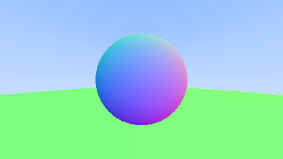

# Learn Ray Tracing One Weekend
[Ray Tracing in One Weekend](https://raytracing.github.io/books/RayTracingInOneWeekend.html) 是学习光追的优秀教程，接下来跟着一步一步实现一个小型的光追渲染器

## 01 Create Image

- 使用[ppm格式](https://convertio.co/zh/ppm-converter/#:~:text=PPM%E6%A0%BC%E5%BC%8F%E6%98%AF%E7%94%B1Jeff%20Poskanzerom%E5%BC%80%E5%8F%91%E7%9A%84%E3%80%82%20%E6%94%AF%E6%8C%81%E7%9A%84%E8%BD%AC%E5%8C%96%20%E6%98%BE%E7%A4%BA%E5%85%A8%E9%83%A8,PPM%20%E8%BD%AC%E6%8D%A2%E8%B4%A8%E9%87%8F%E8%AF%84%E5%88%86%204.7%20%285%2C062%E7%A5%A8%29)

- 没啥特别好说的，是将渲染的图像保存成ppm格式，win10下去[ppmViewer](https://www.cs.rhodes.edu/welshc/COMP141_F16/ppmReader.html)打开

- [01_create_image.cpp](./01_create_image/01_create_image.cpp)

- run

    ```
    01_create_image.exe > 01_create_image.ppm
    ```
    去ppmViewer打开`01_create_image.ppm`

## 02 `vec3` Class

- 实现一个`vec3`工具类，具备大部分向量的功能，头文件见[vec3.h](../../include/InWeekend/vec3.h)

- 值得注意的地方：

    - `x()`, `y()`, `z()`返回各三分量

    - `operator` + `[]`/`+=`/`*=`/`/=`, 重载常用的运算符

    - `length()`, `length_sqarend()`, 返回vec3向量的长度和长度平方

    - `write_color()`, 将vec3向量表示成rgb颜色值[0 ~ 255]写到`std::cout`

    - `random()` 生成取值[0, 1]的随机vec3向量

    - `near_zero()` 判断vec3向量三分量是否都是接近0

    - `dot()`, `cross()` vec3向量点乘，叉乘

    - `unit_vector()` 返回vec3 v的单位向量

    - `random_unit_vector()`, 生成取值[0, 1]的单位vec3向量

    - `reflect()`返回反射向量

## 03 Ray Color

- 实现一个射线Ray类，$\mathbf{\vec{P}} = \mathbf{\vec{O}} + t\mathbf{\vec{d}}$. 头文件 -> [ray.h](../../include/InWeekend/ray.h)

- `orig`和`dir`对应射线原点$\mathbf{\vec{O}}$和射线方向$\mathbf{\vec{d}}$

- `at(double t)` -> 实现$\mathbf{\vec{P}} = \mathbf{\vec{O}} + t\mathbf{\vec{d}}$

- 光线追踪coarse框架

    

    - 以右手坐标系为例，z-轴背向画布朝外

    - Ray为从原点(0, 0, 0)往画布打出的射线，所以$\mathbf{\vec{O}} = (0, 0, 0)$, $\mathbf{\vec{d}}$为图中红色的向量所示

    - 方向向量$\mathbf{\vec{d}}$表示方式为：**lower_left_corner** + u * **horizontal** + v * **vertical** - **origin**

        - horizontal和vertical向量表示：
            
            ```python
            aspect_radio = 16.0 / 9.0
            viewport_height = 2.0 # 画布范围[-1, 1]长度2
            viewport_width = aspect_radio * viewport_height

            horizontal = vec3(viewport_width, 0.0, 0.0)
            vertical = vec3(0.0, viewport_height, 0.0)
            lower_left_corner = origin - horizontal / 2 - vertical / 2 - vec3(0, 0, focal_length) # focal_length 相机到画布距离，换个说法画布在z-轴位置
            ```

    - 光追coarse框架代码

        ```python
        def ray_color(ray, scene, t_min, t_max):
            closest_so_far = t_max
            pixel_color = (0, 0, 0)
            for object in scene:
                if ray.hit(object) == True:
                    if t_min < (ray.t at hit place) < closest_so_far:
                        pixel_color = surface color at place where ray hit object
            return pixel_color

        for i in range(image_width):
            for j in range(image_height):
                u = i / (image_width - 1)
                v = j / (image_height - 1)
                dir = lower_left_corner + u * horizontal + v * vertical - origin
                ray <- Ray(origin, dir)
                pixel_color = ray_color(ray, scene, 0, infinity)
        ```

## 04 Hit Sphere

- 与球体求交，理论公式推导部分参考[5.1 Ray-Sphere Intersection](https://raytracing.github.io/books/RayTracingInOneWeekend.html#addingasphere/ray-sphereintersection)

- 求交问题转换为求$\mathbf{\vec{P}} = \mathbf{\vec{O}} + t\mathbf{\vec{d}}$的$t$, 球体最后求解方程为：

    $$ \mathbf{\vec{d}} \cdot \mathbf{\vec{d}} t^2 + 2 \mathbf{\vec{d}} \cdot (\mathbf{\vec{O}} - \mathbf{\vec{C}}) t + (\mathbf{\vec{O}} - \mathbf{\vec{C}}) \cdot (\mathbf{\vec{O}} - \mathbf{\vec{C}}) - r^2 = 0$$

- 上述方程的$\mathbf{\vec{C}}$和$r$为一个球体的球心和半径。其实这就是$ax^2 + bx + c = 0$一元二次方程，自变量为$t$

- 因此当上述方程有两个根表示hit两次，一个根表示hit一次，无根表示不会相交

    

- hit处返回的ray_color

    ```c++
    // 求解一元二次方程，判断是否相交，返回相交最近处的时间t
    double hit_sphere(const point3& center, double radius, const ray& r)
    {
        vec3 oc = r.origin() - center;
        // auto a = dot(r.direction(), r.direction());
        // auto b = 2.0 * dot(oc, r.direction());
        // auto c = dot(oc, oc) - radius * radius;
        // auto discriminant = b * b - 4 * a * c;
        // b = 2h 简化后
        auto a = r.direction().length_squared();
        auto half_b = dot(oc, r.direction());
        auto c = oc.length_squared() - radius * radius;
        auto discriminant = half_b * half_b - a * c;
        if (discriminant < 0)
            return -1.0;
        else
            return (-half_b - sqrt(discriminant)) / a;
    }

    auto t = hit_sphere(point3(0, 0, -1), 0.5, r);
    if (t > 0.0)
    {
        vec3 N = unit_vector(r.at(t) - vec3(0, 0, -1));
        return 0.5 * color(N.x() + 1, N.y() + 1, N.z() + 1);
    }
    ```

## 05 Hittable Objects

- 上述的sphere的hit是怎针对场景中一个球体进行的，当场景里面有多个物体，在计算求交时候，可以考虑设计一个**抽象类hittable**，让会有hit的物体都继承自这个类，同时需要重写**hit虚函数**

    ```c++
    class hittable
    {
    public:
        virtual bool hit(const ray& r, double t_min, double t_max, hit_record& rec) const = 0;
    };

    ```

- 举个例子，sphere继承hittable类，重写hit虚函数，代码见[sphere.h](../../include/InWeekend/sphere.h)

    ```c++
    class sphere: public hittable // 继承hittable抽象类
    {
    public:
        vec3 center;
        double radius;
        
        ...

        // 重写hit函数
        virtual bool hit(const ray& r, double t_min, double t_max, hit_record& rec) const override;
    };

    // Sphere的hit函数
    bool sphere::hit(const ray& r, double t_min, double t_max, hit_record& rec) const
    {
        vec3 oc = r.origin() - center;
        auto a = r.direction().length_squared();
        auto half_b = dot(oc, r.direction());
        auto c = oc.length_squared() - radius * radius;
        auto discriminant = half_b * half_b - a * c;

        ...
        return false;
    }
    ```

- 值得注意到，hit函数传入了一个`hit_record`结构体，用来记录相交时候的有关参数(位置p, 法向n， 相交时间t, 材质mat)

    ```c++
    // 相交记录结构体
    struct hit_record
    {
        vec3 p; // 相交位置 p = o + t * d
        vec3 normal; // 交点处面法向
        
        double t; // 相交处的时间 t
        bool front_face; // 射线ray与法向normal是否法向一致
        shared_ptr<Material> mat_ptr; // 材质的智能指针
        inline void set_face_normal(const ray& r, const vec3& outward_normal)
        {
            front_face = dot(r.direction(), outward_normal) < 0;
            normal = front_face? outward_normal: -outward_normal;
        }
    };
    ```

- 对于场景内多个相交的物体，用一个类的成员变量数组来记录这些物体

    ```c++
    class hittable_list: public hittable
    {
    public:
        std::vector<shared_ptr<hittable> > objects; // 记录相交的物体们
        
        ...

        void clear() {objects.clear();} // 清空
        void add(shared_ptr<hittable> object) {objects.push_back(object);} // 增加

        virtual bool hit(const ray& r, double t_min, double t_max, hit_record& rec) const override;
    };

    // 重写hit函数，for循环下，对数组内每个物体进行求交
    bool hittable_list::hit(const ray& r, double t_min, double t_max, hit_record& rec) const
    {
        hit_record temp_rec;
        bool hit_anything = false;
        auto closest_so_far = t_max;

        for (const auto& object: objects) // 对场景内每个物体
        {
            if (object->hit(r, t_min, closest_so_far, temp_rec)) // 在时间 t_min < t < closest_so_far内发生hit
            {
                hit_anything = true;
                closest_so_far = temp_rec.t; // 更新closest_so_far
                rec = temp_rec;
            }
        }

        return hit_anything;
    }
    ```

- 至此，一个光追雏形代码可以如下写出，具备光追渲染器的基本组成，代码见[05_hittable_objects](./05_hittable_objects/05_hittable_objects.cpp)

    ```c++
    #include "InWeekend/rtweekend.h"

    #include "InWeekend/hittable_list.h"
    #include "InWeekend/sphere.h"

    #include <iostream>

    // 射线透过画布打到场景返回的颜色
    color ray_color(const ray& r, const hittable& world)
    {
        hit_record rec;
        if (world.hit(r, 0, infinity, rec))
        {
            return 0.5 * (rec.normal + color(1, 1, 1)); // 暂时用法向替代rgb颜色
        }
        vec3 unit_direction = unit_vector(r.direction());
        auto t = 0.5 * (unit_direction.y() + 1.0);
        return (1.0 - t) * color(1.0, 1.0, 1.0) + t * color(0.5, 0.7, 1.0);
    }

    int main()
    {
        // 图像（画布）参数
        const auto aspect_ratio = 16.0 / 9.0;
        const int image_width = 400;
        const int image_height = static_cast<int>(image_width / aspect_ratio);

        // 场景内物体加入数组中
        hittable_list world;
        world.add(make_shared<sphere>(point3(0, 0, -1), 0.5));
        world.add(make_shared<sphere>(point3(0, -100.5, -1), 100));

        // 相机参数
        auto viewport_height = 2.0;
        auto viewport_width = aspect_ratio * viewport_height;
        auto focal_length = 1.0;

        auto origin = point3(0, 0, 0);
        auto horizontal = vec3(viewport_width, 0, 0);
        auto vertical = vec3(0, viewport_height, 0);
        auto lower_left_corner = origin - horizontal / 2 - vertical / 2 - vec3(0, 0, focal_length);

        // Render
        std::cout << "P3\n" << image_width << " " << image_height << "\n255\n";

        for (int j = image_height-1; j >= 0; --j) 
        {
            std::cerr << "\rScanlines remaining: " << j << ' ' << std::flush;
            for (int i = 0; i < image_width; ++i) 
            {
                auto u = double(i) / (image_width - 1);
                auto v = double(j) / (image_height - 1);
                ray r(origin, lower_left_corner + u * horizontal + v * vertical - origin); // 射线 o + t * d
                color pixel_color = ray_color(r, world);
                pixel_color.write_color(std::cout);
            }
        }

        std::cerr << "\nDone.\n";
    }
    ```

- 运行效果：

    

## 06 Antialiasing

- 一般的抗锯齿都会想到MSAA等多重采样方案，光追其实也可以多采样完成抗锯齿

- 只不过这里的抗锯齿是多重采样从原点$\mathbf{\vec{O}}$发射出去的射线，这就用到`random_double()`生成多个[-1, 1]范围的`vec3`，给每个画布上的像素点加个扰动构成多重采样射线

    ```c++
    for (int j = image_height-1; j >= 0; --j) 
    {
        std::cerr << "\rScanlines remaining: " << j << ' ' << std::flush;
        for (int i = 0; i < image_width; ++i) 
        {
            // 对每个像素额外采样samples_per_pixel个射线
            // 获取到光追颜色后再取平均
            color pixel_color(0, 0, 0);
            for (int s = 0; s < samples_per_pixel; ++ s)
            {
                auto u = (i + random_double()) / (image_width - 1);
                auto v = (j + random_double()) / (image_height - 1);
                ray r = cam.get_ray(u, v);
                pixel_color += ray_color(r, world);
            }
            pixel_color.write_color(std::cout, samples_per_pixel);
        }
    }

    ```

## 07 Diffuse Materials

- 漫反射：当一个光线打到漫反射材质物体表面上，发生反射的方向是随机的。

- [Ray Tracing in One Weekend](https://raytracing.github.io/books/RayTracingInOneWeekend.html)这本书中介绍了三种反射出去的方向计算方式，这里挑其中一个说明

- 如图所示，ray在$\mathbf{P}$处发生hit，$\mathbf{\vec{N}}$为面法向，从球心出发向外。那么设计漫反射方向$\mathbf{\vec{PS}}$，其中$\mathbf{S}$是以$\mathbf{P} + \mathbf{\vec{N}}$为球心的单位圆上，也就是$\mathbf{\vec{PS}} = \mathbf{\vec{PN}} + \mathbf{\vec{NS}}$

    

- 代码如下：

    ```c++
    // 返回[-1, 1]随机vec3向量
    vec3 random_unit_vector()
    {
        return unit_vector(random_in_unit_sphere());
    }

    // 递归函数，模拟反射过程
    color ray_color(const ray& r, const hittable& world, int depth)
    {
        // 递归终点，反射超过50次，就此返回全黑(0, 0, 0)
        if (depth <= 0)
            return color(0, 0, 0);

        hit_record rec;
        if (world.hit(r, 0.001, infinity, rec))
        {
            point3 target = rec.p + rec.normal + random_unit_vector(); // point S
            return 0.5 * ray_color(ray(rec.p, target - rec.p), world, depth - 1); 
            // target - rec.p = PS向量
        }
        vec3 unit_direction = unit_vector(r.direction());
        auto t = 0.5 * (unit_direction.y() + 1.0);
        return (1.0 - t) * color(1.0, 1.0, 1.0) + t * color(0.5, 0.7, 1.0);
    }
    
    ```

- gamma校正，对渲染出来的图像进行gamma校正来修正图像，gamma校正理论见[图像处理之gamma校正](https://www.cnblogs.com/qiqibaby/p/5325193.html)

- 经过gamma校正后的最终效果：

    

## 08 Metal Materials
- Materials Abstract Class

    - 材质抽象类设计目的：用以被各不同材质类继承，重写`scatter`函数实现不同材质对光线反射
    
    ```C++
    class material {
    public:
        virtual bool scatter(
                const ray& r_in, const hit_record& rec, color& attenuation, ray& scattered
            ) const = 0;
    };
    ```

- Metal Material

    - 金属材质特性：镜面反射

    

    绿色光线v入射，红色光线出射，C++代码表示

    ```C++
    vec3 reflect(const vec3& v, const vec3& n) {
        return v - 2 * dot(v, n) * n; // dot(v, n) * n -- B vector
    }
    ```

- Ray at Metal surface

    - 当光线打到金属表面时，发生如上镜面反射。对于`Metal`类来说，重写`scatter`函数：

    ```C++
    class Metal: public Material
    {
    public:
        color albedo;
        Metal(const color& a): albedo(a) {}

        virtual bool scatter(const ray& ray_in, const hit_record& rec, color& attenuation, ray& scattered) const override
        {
            vec3 reflected = reflect(unit_vector(ray_in.direction()), rec.normal);
            scattered = ray(rec.p, reflected); // 反射入射光线
            attenuation = albedo; // 衰减
            return (dot(scattered.direction(), rec.normal) > 0);
        }
    };
    ```

    - 光追上色，ray_color函数

    ```C++
    color ray_color(const ray& r, const hittable& world, int depth)
    {
        ...

        if (world.hit(r, 0.001, infinity, rec))
        {
            ray scattered; // 镜面反射光线
            color attenuation; // 颜色衰减
            if (rec.mat_ptr->scatter(r, rec, attenuation, scattered))
                return attenuation * ray_color(scattered, world, depth - 1); //衰减 * 镜面反射光线打到其他地方
            return color(0, 0, 0);
        }
        
        ...
    }
    ```

    - 效果:

    

- Fuzz Metal

    - 带有粗糙质感的金属：给反射方向加个随机扰动，扰动半径`fuzz`取值[0, 1]之间，取值越大，表面粗糙质感越强烈

    

    - 扰动加入

    ```C++
    class Metal: public Material
    {
    public:
        
        ... 

        virtual bool scatter(const ray& ray_in, const hit_record& rec, color& attenuation, ray& scattered) const override
        {
            vec3 reflected = reflect(unit_vector(ray_in.direction()), rec.normal);
            scattered = ray(rec.p, reflected + fuzz * random_in_unit_sphere()); // fuzz 表示粗糙质感的扰动半径，半径越大粗糙感越强
            attenuation = albedo;
            return (dot(scattered.direction(), rec.normal) > 0);
        }
    };
    ```

    - 效果:

    ```C++
    // in 08_metal_materials.cpp
    // World
    ...
    auto material_left   = make_shared<Metal>(color(0.8, 0.8, 0.8), 0.3); // fuzz = 0.3
    auto material_right  = make_shared<Metal>(color(0.8, 0.6, 0.2), 1.0); // fuzz = 1.0
    ...
    ```

    


## 09_Dielectrics

- 绝缘体：一条光线打过来，会发生**折射**和**反射**

    

- Snell Law

    - 斯奈尔定律：$\eta \cdot \sin{\theta} = \eta' \cdot \sin{\theta'}$

    - 空气 $\eta = 1.0$

- 折射方向

    - 计算折射反向的数学公式推导见[4.2 折射方向的计算
](https://zhuanlan.zhihu.com/p/144403005)

    - 拿来主义：

    $$ \vec{t} = \frac{\eta}{\eta'} (\vec{v} - (\vec{t} \cdot \mathbf{n}) \mathbf{n} ) - \mathbf{n} \sqrt{1 - (\frac{\eta}{\eta'} (\vec{v} - (\vec{v} \cdot \mathbf{n}) \mathbf{n}))^2}, $$

    - 全反射：**注意**，并不是所有的光线打过来都会有折射，当入射方向的角度超过一定范围后，是**全反射**了，这个范围按照如下公式确定：

    $$ \sin{\theta} = \sqrt{1 - \vec{v} \cdot \mathbf{n}} \leq 1.0. $$

    - 综上，折射方向C++表示如下

    ```C++
    class Dielectric : public Material {
    public:
        double ir; // 当前材质的\eta
        Dielectric(double index_of_refraction): ir(index_of_refraction) {}

        virtual bool scatter(const ray& ray_in, const hit_record& rec, color& attenuation, ray& scattered) const override 
        {
            attenuation = color(1.0, 1.0, 1.0);
            double refraction_ratio  = rec.front_face? (1.0/ir): ir; // \eta / \eta'

            vec3 unit_direction = unit_vector(ray_in.direction());
            double cos_theta = ffmin(dot(-unit_direction, rec.normal), 1.0);
            double sin_theta = sqrt(1.0 - cos_theta * cos_theta);
            
            bool cannot_refract = refraction_ratio * sin_theta > 1.0; // 是否能够折射还是全反射了
            vec3 direction;
            if (cannot_refract || reflectance(cos_theta, refraction_ratio) > random_double())
                direction = reflect(unit_direction, rec.normal); // 反射方向
            else
                direction = refract(unit_direction, rec.normal, refraction_ratio); // 折射方向

            scattered = ray(rec.p, direction);
            return true;
        }
    }

    // 折射方向
    vec3 refract(const vec3& ray_in, const vec3& n, double etai_over_etat) 
    {
        auto cos_theta = fmin(dot(-ray_in, n), 1.0);
        vec3 r_out_vertical =  etai_over_etat * (ray_in + cos_theta * n); // R_vertical
        vec3 r_out_parallel = -sqrt(fabs(1.0 - r_out_vertical.length_squared())) * n; // R_parallel
        return r_out_vertical + r_out_parallel; 
    }
    ```

- reflect probability -- 反射概率

    - What is: 对于一个绝缘体来说，当满足折射条件（不发生全反射）后，并不是一定发生折射，会有一个概率发生反射，这个反射的概率跟很多因素（折射率、入射角度）有关，采用**schlick**简化之后：

    $$ Rp = R_0 + (1 - R_0) (1 - \cos{\theta})^5, R_0 = (\frac{\eta - \eta'}{\eta + \eta'})^2. $$

    ```C++
    static double reflectance(double cosine, double ref_idx)
    {
        auto r0 = (1 - ref_idx) / (1 + ref_idx);
        r0 = r0 * r0;
        return r0 + (1 - r0) * pow((1 - cosine), 5);
    }
    ```

    - 上色

    ```C++
    virtual bool scatter(const ray& ray_in, const hit_record& rec, color& attenuation, ray& scattered) const override 
    {
        ...
        
        bool cannot_refract = refraction_ratio * sin_theta > 1.0;
        vec3 direction;
        // 随机生成数，判断是否在反射概率范围内
        if (cannot_refract || reflectance(cos_theta, refraction_ratio) > random_double())
            direction = reflect(unit_direction, rec.normal);
        else
            direction = refract(unit_direction, rec.normal, refraction_ratio);

        ...
    }

    // in 09_Dielectrics.cpp
    for (int j = image_height-1; j >= 0; --j) 
    {
        std::cerr << "\rScanlines remaining: " << j << ' ' << std::flush;
        for (int i = 0; i < image_width; ++i) 
        {
            color pixel_color(0, 0, 0);
            for (int s = 0; s < samples_per_pixel; ++ s)
            {
                auto u = (i + random_double()) / (image_width - 1);
                auto v = (j + random_double()) / (image_height - 1);
                ray r = cam.get_ray(u, v);
                pixel_color += ray_color(r, world, max_depth);
            }
            pixel_color.write_color(std::cout, samples_per_pixel);
        }
    }
    ```